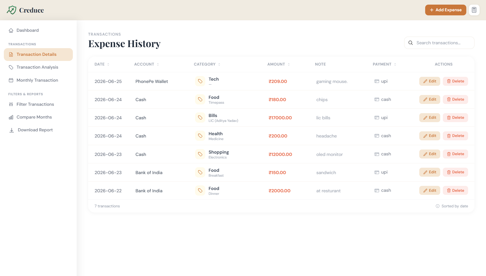
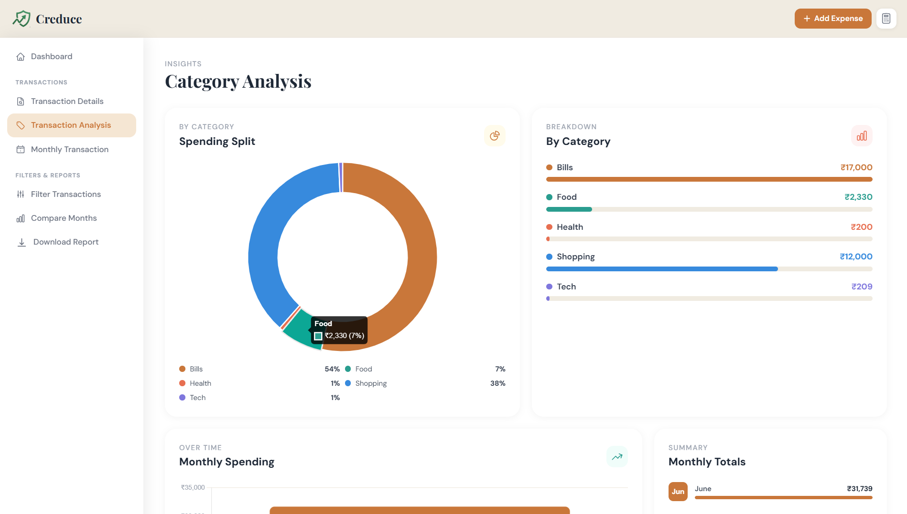
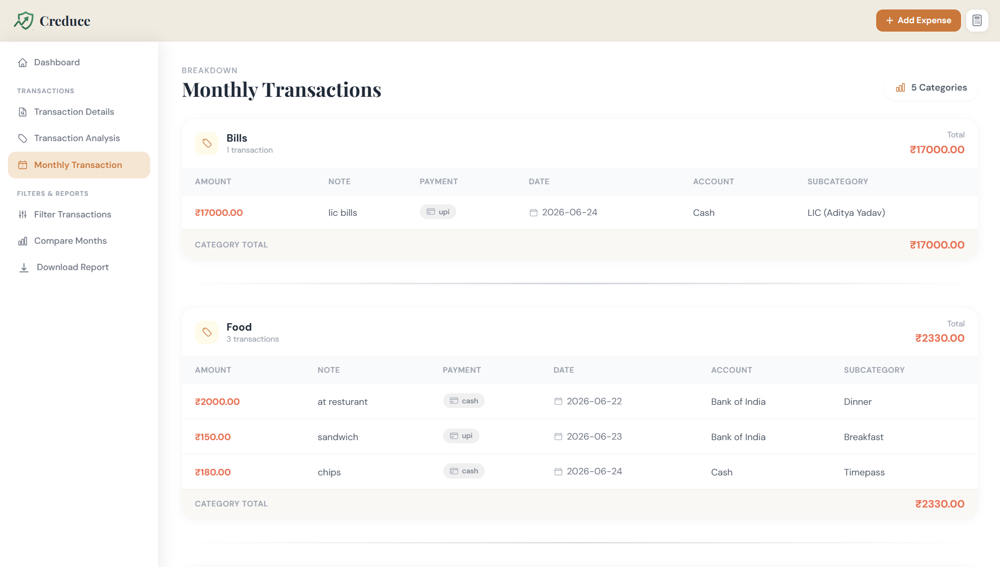
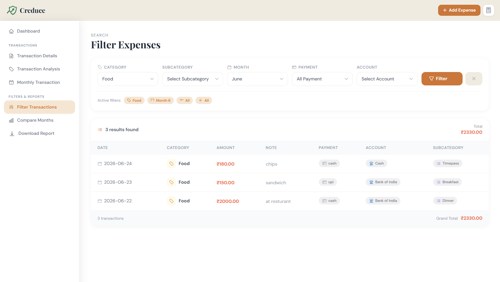
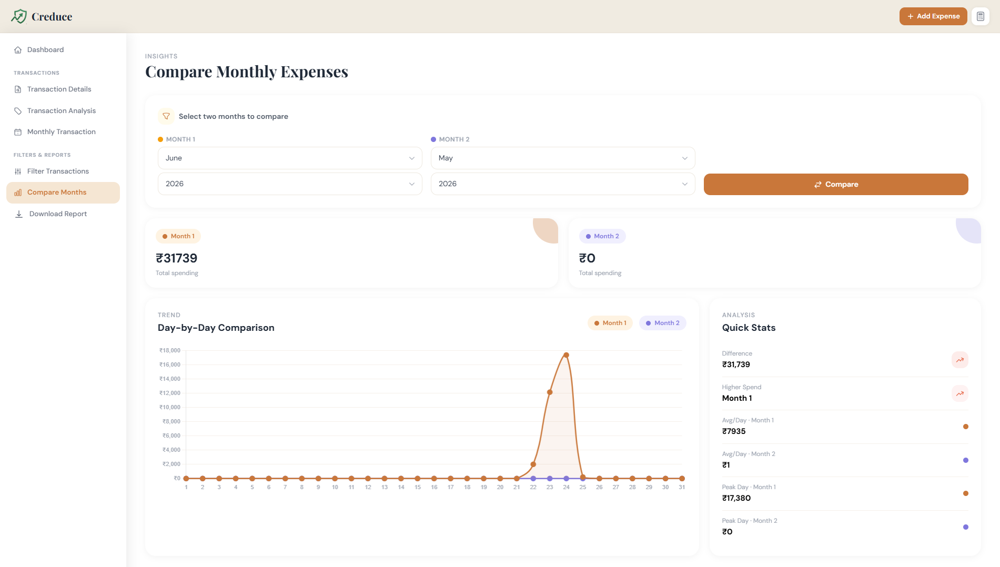
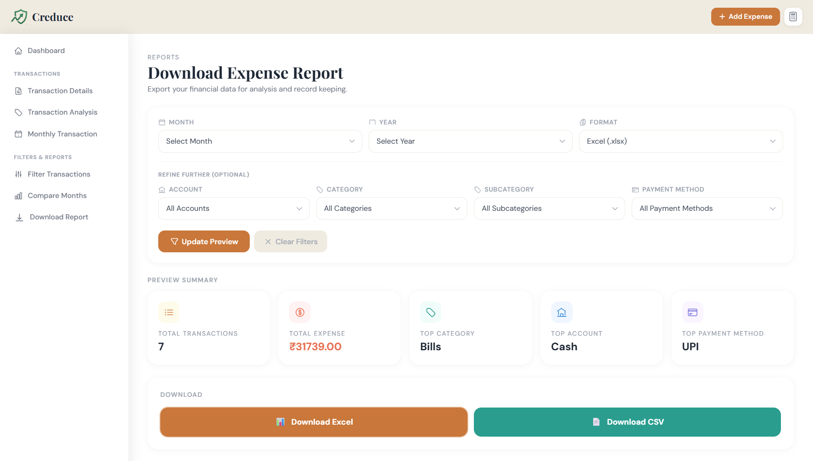
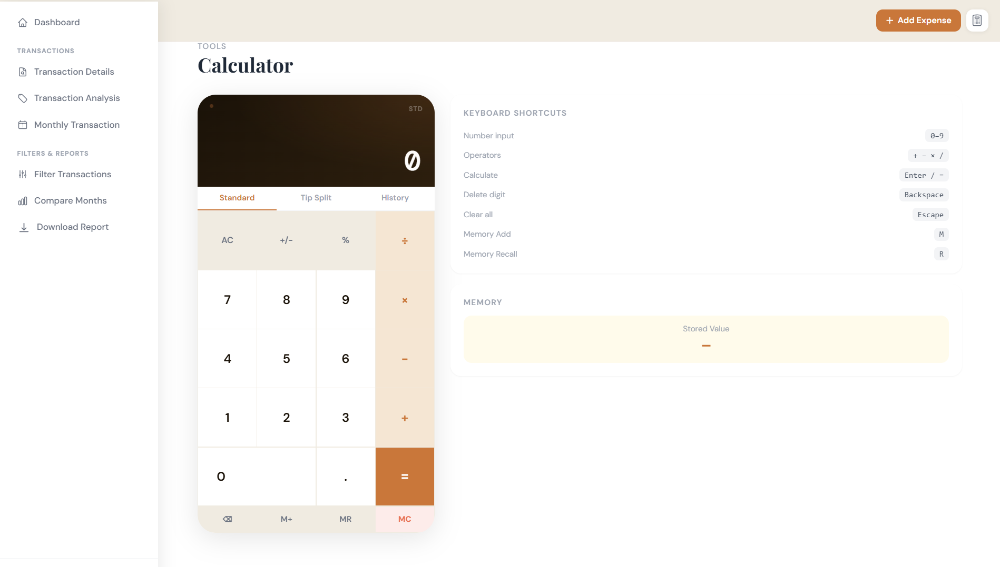
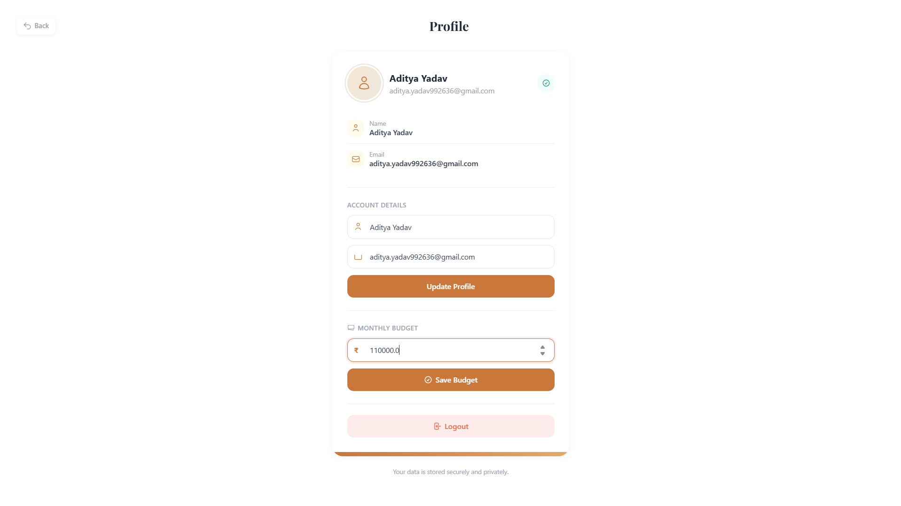
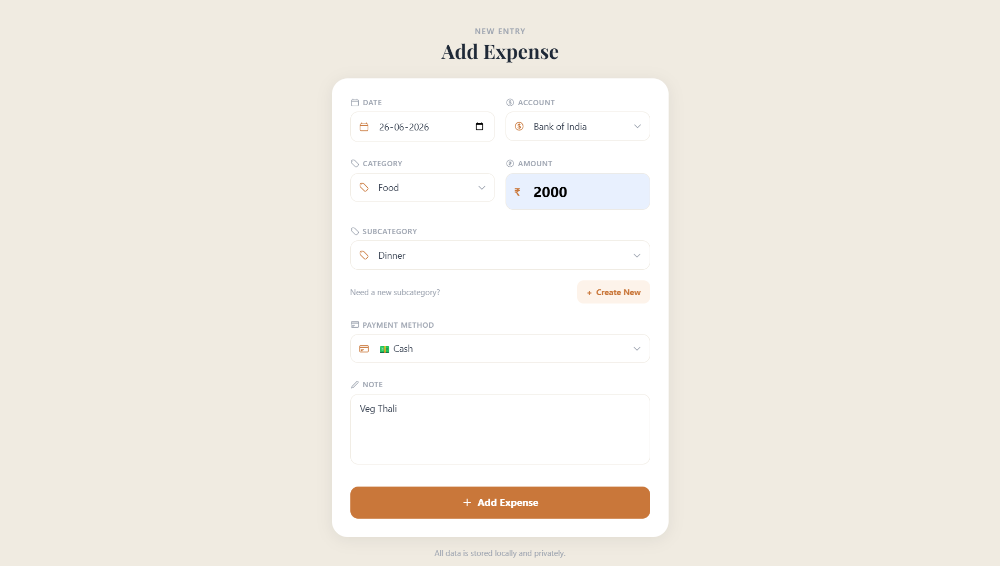
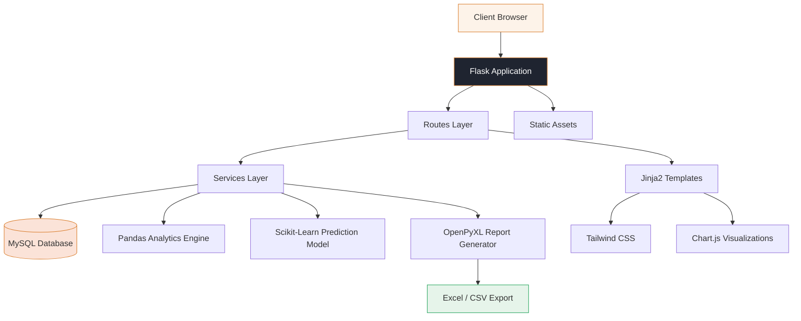

<div align="center">


# Creduce

### Master Your Money, Grow Your Future.

Creduce is a modern personal finance platform that turns everyday spending into structured, actionable insight — built on Flask, MySQL, and Pandas, and wrapped in a clean, data-rich interface.

<br/>

[](https://www.python.org/)
[](https://flask.palletsprojects.com/)
[](https://www.mysql.com/)
[](https://pandas.pydata.org/)
[](https://scikit-learn.org/)
[](https://tailwindcss.com/)
[](https://www.chartjs.org/)
[](https://openpyxl.readthedocs.io/)
[](#)
[](LICENSE)
[](#roadmap)

</div>

<br/>

---

## Why Creduce

The name comes from two ideas fused together:

> **Credo** — *to trust* · **Accrue** — *to grow*

Most people don't lose money to one bad decision. They lose it slowly — an untracked subscription, an unplanned "small" purchase, a month where nobody checked the numbers. Spreadsheets get abandoned. Budgeting apps get uninstalled. The discipline rarely survives contact with real life.

Creduce was built around a simpler premise:

> Every expense tracked is a step toward financial freedom.

Instead of asking users to *try harder*, Creduce removes the friction — automatic categorization, instant visual feedback, monthly comparisons, and predictive insight — so that staying disciplined with money feels less like a chore and more like checking a dashboard you actually want to open.

**What Creduce solves:**

- **Visibility** — most people genuinely don't know where their money goes until it's gone. Creduce makes spending visible in real time.
- **Budget drift** — a budget that isn't tracked against actual spend is just a wish. Creduce closes that loop automatically.
- **Decision fatigue** — categorized, filterable, comparable data turns "how am I doing this month?" into a five-second answer.
- **Long-term habit formation** — month-over-month comparisons and predictive insights nudge users toward consistency, not just one good month.

---

## Features

<table>
<tr><th width="60">Icon</th><th>Feature</th><th>Description</th></tr>

<tr><td>📊</td><td><b>Dashboard</b></td><td>A real-time command center showing today's, this week's, and this month's spend, budget status, and top spending highlights at a glance.</td></tr>

<tr><td>🎯</td><td><b>Budget Management</b></td><td>Set a monthly budget and track exactly how much has been spent versus how much remains, with a live progress indicator.</td></tr>

<tr><td>💸</td><td><b>Expense Tracking</b></td><td>Log every transaction with amount, date, account, payment method, and notes in seconds.</td></tr>

<tr><td>🏷️</td><td><b>Categories</b></td><td>Classify every expense — Food, Bills, Shopping, Health, Tech, and more — for instant clarity on spending patterns.</td></tr>

<tr><td>🗂️</td><td><b>Subcategories</b></td><td>Drill down further within a category (e.g. Food → Breakfast, Dinner, Timepass) for granular reporting.</td></tr>

<tr><td>🏦</td><td><b>Multiple Accounts</b></td><td>Track Cash, Bank, and Wallet accounts independently, with per-account transaction history.</td></tr>

<tr><td>📅</td><td><b>Monthly Transactions</b></td><td>View all activity for any given month, organized chronologically for fast review.</td></tr>

<tr><td>📈</td><td><b>Analytics</b></td><td>Interactive spending-split donut charts, category breakdowns, and monthly trend lines powered by Pandas.</td></tr>

<tr><td>🔁</td><td><b>Compare Months</b></td><td>Place any two months side-by-side with a day-by-day spending curve and instant quick-stats (difference, average/day, peak day).</td></tr>

<tr><td>⬇️</td><td><b>Download Reports</b></td><td>Export clean Excel and CSV reports of any period using OpenPyXL — ready for record-keeping or tax season.</td></tr>

<tr><td>📱</td><td><b>Responsive Design</b></td><td>A fully responsive Tailwind CSS interface that works as well on a phone as it does on a desktop.</td></tr>

<tr><td>🧮</td><td><b>Calculator</b></td><td>A built-in calculator with standard mode, tip-split mode, calculation history, and memory functions — no need to leave the app.</td></tr>

<tr><td>👤</td><td><b>Profile Management</b></td><td>Manage account details and monthly budget, with secure session-based authentication and logout.</td></tr>

</table>

---

## Screenshots

<table width="100%">
<tr>
<td align="center" colspan="2">

<br/><sub><b>Dashboard</b> — budget summary, spending highlights, and predicted next-month spend at a glance.</sub>
</td>
</tr>
</table>

<table width="100%">
<tr>
<td width="50%" align="center">

<br/><sub><b>Transaction History</b> — every expense, searchable and editable.</sub>
</td>
<td width="50%" align="center">

<br/><sub><b>Category Analysis</b> — donut chart and breakdown of where your money goes.</sub>
</td>
</tr>
</table>

<table width="100%">
<tr>
<td width="50%" align="center">

<br/><sub><b>Monthly Transactions</b> — a focused, chronological view of any month.</sub>
</td>
<td width="50%" align="center">

<br/><sub><b>Filter Transactions</b> — narrow expenses by category, subcategory, month, payment, or account.</sub>
</td>
</tr>
</table>

<table width="100%">
<tr>
<td width="50%" align="center">

<br/><sub><b>Compare Months</b> — day-by-day comparison of two months with quick stats.</sub>
</td>
<td width="50%" align="center">

<br/><sub><b>Download Report</b> — export Excel or CSV reports in a click.</sub>
</td>
</tr>
</table>

<table width="100%">
<tr>
<td width="50%" align="center">

<br/><sub><b>Calculator</b> — standard mode, tip split, history, and memory recall.</sub>
</td>
<td width="50%" align="center">

<br/><sub><b>User Profile</b> — manage account details and your monthly budget.</sub>
</td>
</tr>
</table>

<table width="100%">
<tr>
<td align="center" colspan="2">

<br/><sub><b>Add Expense</b> — log a new transaction in seconds, from anywhere in the app.</sub>
</td>
</tr>
</table>

---

## Architecture



---

## Technology Stack

| Category | Technology | Purpose |
|---|---|---|
| **Frontend** | HTML5, Jinja2, Tailwind CSS | Responsive, component-driven UI |
| **Backend** | Python, Flask | Application logic, routing, session handling |
| **Database** | MySQL | Persistent storage for transactions, accounts, budgets |
| **Analytics** | Pandas | Category breakdowns, monthly aggregation, trend computation |
| **Machine Learning** | Scikit-Learn | Predicted next-month spending |
| **Charts** | Chart.js | Donut charts, trend lines, comparison graphs |
| **Exports** | OpenPyXL | Excel and CSV report generation |
| **Authentication** | Flask Sessions, Werkzeug Security | Secure login, password hashing, route protection |
| **Deployment** | Gunicorn-ready, Render / Railway compatible | Production deployment |

---

## Folder Structure

```
Creduce/
├── ml/              # Spending-prediction model and ML utilities (Scikit-Learn)
├── models/          # Database models / ORM schema definitions
├── routes/          # Flask blueprints — dashboard, transactions, analytics, profile
├── services/        # Business logic — budgeting, filtering, report generation
├── static/          # CSS, JavaScript, and image assets
├── templates/        # Jinja2 HTML templates for every page
├── tests/           # Unit and integration tests
├── utils/           # Shared helper functions
│
├── app.py           # Application entry point
├── config.py        # Environment-based configuration
├── requirements.txt # Python dependencies
└── README.md        # You are here
```

| Folder | Responsibility |
|---|---|
| `ml/` | Houses the prediction model used to forecast next month's spending. |
| `models/` | Defines the database schema for users, transactions, accounts, and budgets. |
| `routes/` | Maps incoming requests to the correct page or API behaviour. |
| `services/` | Contains the core business logic — kept separate from routing for testability. |
| `static/` | Tailwind output, custom JS (Chart.js bindings, calculator logic), and images. |
| `templates/` | All rendered HTML views, organized by feature. |
| `tests/` | Automated tests covering services and routes. |
| `utils/` | Small, reusable helper functions used across the codebase. |

---

## Installation

**1. Clone the repository**

```bash
git clone https://github.com/<your-username>/creduce.git
cd creduce
```

**2. Create a virtual environment**

```bash
python -m venv venv
source venv/bin/activate      # Windows: venv\Scripts\activate
```

**3. Install dependencies**

```bash
pip install -r requirements.txt
```

**4. Configure environment variables**

Create a `.env` file in the project root (see table below) and fill in your own values.

**5. Run the application**

```bash
python app.py
```

The app will be available at `http://localhost:5000`.

---

## Environment Variables

| Variable | Description |
|---|---|
| `SECRET_KEY` | Secret key used to sign Flask sessions |
| `MYSQL_HOST` | Hostname of the MySQL server |
| `MYSQL_USER` | MySQL database username |
| `MYSQL_PASSWORD` | MySQL database password |
| `MYSQL_DATABASE` | Name of the MySQL database |
| `FLASK_ENV` | `development` or `production` |
| `FLASK_DEBUG` | `True` / `False` — enable debug mode locally |

> Never commit your `.env` file. Add it to `.gitignore`.

---

## Usage Guide

<div align="center">

**1. Register**
↓
**2. Login**
↓
**3. Set Your Monthly Budget**
↓
**4. Add Your Accounts**
↓
**5. Record Expenses**
↓
**6. Analyze Spending**
↓
**7. Compare Months**
↓
**8. Download Reports**

</div>

Each step builds on the last — once a budget and accounts exist, every recorded expense automatically feeds the dashboard, analytics, and monthly comparisons in real time.

---

## Key Highlights

<table>
<tr>
<td width="25%" align="center"><b>⚡ Fast Analytics</b><br/><sub>Pandas-powered, instant on load</sub></td>
<td width="25%" align="center"><b>🏦 Multiple Accounts</b><br/><sub>Cash, bank, and wallet tracking</sub></td>
<td width="25%" align="center"><b>📅 Monthly Reports</b><br/><sub>Clean, period-based summaries</sub></td>
<td width="25%" align="center"><b>📗 Excel Export</b><br/><sub>OpenPyXL-generated workbooks</sub></td>
</tr>
<tr>
<td width="25%" align="center"><b>📄 CSV Export</b><br/><sub>Portable, spreadsheet-ready data</sub></td>
<td width="25%" align="center"><b>🎯 Budget Planner</b><br/><sub>Live spend-vs-budget tracking</sub></td>
<td width="25%" align="center"><b>🔍 Advanced Filtering</b><br/><sub>Category, account, payment, month</sub></td>
<td width="25%" align="center"><b>📱 Mobile Responsive</b><br/><sub>Built with Tailwind CSS</sub></td>
</tr>
</table>

---

## Roadmap

- [x] Dashboard
- [x] Expense Tracking
- [x] Category Management
- [x] Budget Management
- [x] Analytics
- [x] Compare Months
- [x] Download Reports
- [x] Responsive Design
- [ ] AI Spending Insights
- [ ] OCR Receipt Scanner
- [ ] Voice Expense Entry
- [ ] Savings Goals
- [ ] Investment Tracker
- [ ] Mobile App
- [ ] Bill Reminder

---

## Security

Creduce treats financial data as sensitive by default:

- **Secure authentication** — passwords are hashed, never stored in plain text.
- **Protected routes** — every transaction, budget, and profile endpoint requires an authenticated session.
- **User isolation** — each user can only ever read or modify their own data.
- **Data privacy** — no financial data is shared with third parties.
- **Secure database usage** — parameterized queries prevent SQL injection across the data layer.

---

## Performance

- Responsive UI with minimal load-blocking assets.
- Optimized, indexed MySQL queries for transaction-heavy views.
- Lightweight Flask backend with no unnecessary middleware.
- Pandas-driven analytics computed efficiently, even on larger transaction histories.
- Fast report generation via streamed OpenPyXL writes.

---

## Contributing

Contributions are welcome and appreciated.

1. Fork the repository
2. Create a feature branch — `git checkout -b feature/your-feature`
3. Commit your changes — `git commit -m "Add: your feature"`
4. Push to your branch — `git push origin feature/your-feature`
5. Open a Pull Request

Please keep PRs focused and include a clear description of the change. For larger features, open an issue first to discuss direction.

---

## License

This project is licensed under the **MIT License** — see the [LICENSE](LICENSE) file for details.

---

<div align="center">

## Author

**Aditya Yadav**

[](https://github.com/)
[](https://linkedin.com/)
[](mailto:aditya.yadav992636@gmail.com)

<sub>Built with care, one tracked expense at a time.</sub>

</div>