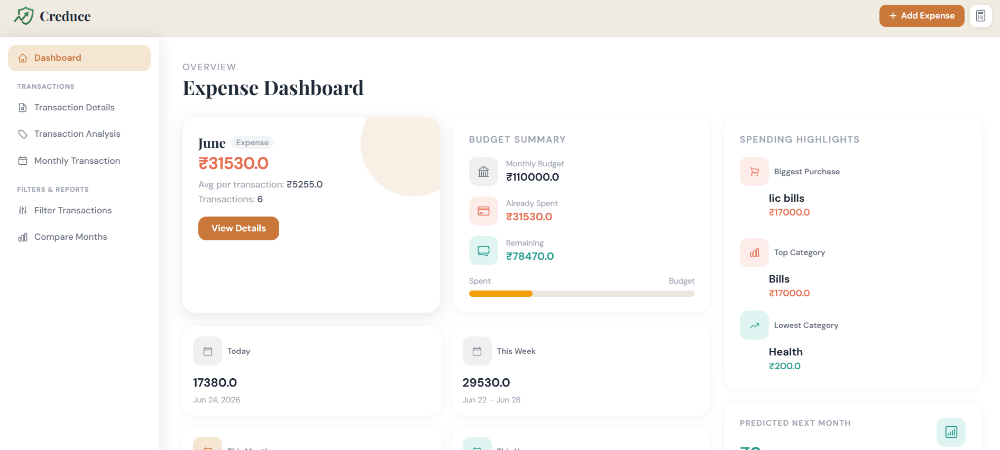

# Creduce

> **Master Your Money, Grow Your Future.**

Creduce is a modern personal finance and expense management platform that helps users track expenses, manage budgets, analyze spending habits, compare monthly expenses, and export financial reports. It is designed to make financial management simple, insightful, and efficient.

---

## About

Creduce is derived from two ideas:

* **Credo** — *To Trust*
* **Accrue** — *To Grow*

Every expense tracked is another step toward better financial discipline and long-term wealth creation.

Instead of simply recording transactions, Creduce provides insights that help users understand where their money goes and make smarter financial decisions.

---

## Features

### Dashboard

* Monthly expense overview
* Budget summary
* Remaining balance
* Spending highlights
* Today's, weekly, monthly and yearly expenses
* Expense prediction

---

### Transaction Management

* Add new expenses
* Edit transactions
* Delete transactions
* Search transactions
* Responsive transaction history

---

### Smart Categorization

* Categories
* Subcategories
* Dynamic subcategory loading
* Custom subcategory creation

Examples:

* Food → Breakfast
* Food → Dinner
* Shopping → Electronics
* Bills → Electricity

---

### Multiple Accounts

Track expenses from different accounts:

* Cash
* Bank Accounts
* UPI Wallets
* Credit Cards
* Debit Cards

---

### Category Analysis

Visualize spending using charts.

Includes:

* Spending by category
* Monthly spending trends
* Category percentage breakdown
* Monthly totals

---

### Monthly Transactions

View all expenses grouped by category for the selected month.

Each category displays:

* Total spent
* Transaction count
* Payment method
* Account
* Subcategory

---

### Advanced Expense Filter

Filter expenses using:

* Category
* Subcategory
* Account
* Payment Method
* Month

Quickly locate any transaction with multiple filters.

---

### Compare Months

Compare expenses between two different months.

Features:

* Expense comparison graph
* Daily spending trend
* Average daily expense
* Peak spending day
* Monthly difference

---

### Download Reports

Generate financial reports in:

* Excel (.xlsx)
* CSV (.csv)

Supports filters:

* Month
* Year
* Category
* Subcategory
* Account
* Payment Method

---

### Budget Management

* Set monthly budget
* Remaining balance
* Spending progress
* Budget utilization

---

### User Profile

* Update profile
* Manage monthly budget
* Secure authentication

---

### Responsive Design

Optimized for:

* Desktop
* Tablet
* Mobile

---

## Screenshots

### Dashboard



---

### Transaction History


---

### Category Analysis


---

### Filter Transactions


---

### Compare Months


---

### Download Report


---

## Tech Stack

### Frontend

* HTML5
* Tailwind CSS
* JavaScript
* Jinja2

### Backend

* Python
* Flask

### Database

* MySQL

### Data Processing

* Pandas
* NumPy

### Machine Learning

* Scikit-learn

### Charts

* Chart.js

### Excel Export

* OpenPyXL

---

## Project Structure

```
Creduce/
│
├── models/
├── routes/
├── services/
├── templates/
├── static/
├── utils/
├── ml/
│
├── app.py
├── config.py
├── requirements.txt
└── README.md
```

---

## Installation

Clone the repository

```bash
git clone https://github.com/yourusername/Creduce.git
```

Move into the project

```bash
cd Creduce
```

Create a virtual environment

```bash
python -m venv venv
```

Activate it

Windows

```bash
venv\Scripts\activate
```

Linux / macOS

```bash
source venv/bin/activate
```

Install dependencies

```bash
pip install -r requirements.txt
```

Run the application

```bash
python app.py
```

---

## Environment Variables

Create a `.env` file.

Example:

```
MYSQL_HOST=localhost
MYSQL_USER=root
MYSQL_PASSWORD=yourpassword
MYSQL_DATABASE=expense_tracker

SECRET_KEY=your_secret_key
```

---

## How to Use

1. Register/Login
2. Set your monthly budget.
3. Add your accounts.
4. Record daily expenses.
5. Organize expenses using categories and subcategories.
6. Analyze spending through interactive charts.
7. Compare expenses across different months.
8. Export reports in Excel or CSV.

---

## Current Features

* Expense Dashboard
* Expense Tracking
* Budget Management
* Category Analysis
* Monthly Transactions
* Compare Months
* Advanced Filters
* Download Reports
* Multiple Accounts
* Custom Categories
* Custom Subcategories
* Responsive UI

---

## Future Roadmap

* AI Spending Insights
* Smart Expense Prediction
* Savings Goals
* Income Tracking
* Recurring Expenses
* Bill Reminders
* Investment Tracker
* Dark Mode
* Mobile Application
* Multi-language Support

---

## Contributing

Contributions are welcome.

1. Fork the repository.
2. Create a feature branch.

```bash
git checkout -b feature/new-feature
```

3. Commit your changes.

```bash
git commit -m "Add new feature"
```

4. Push your branch.

```bash
git push origin feature/new-feature
```

5. Open a Pull Request.

---

## License

This project is licensed under the MIT License.

---

## Author

**Aditya Yadav**

* GitHub: https://github.com/yourusername
* LinkedIn: https://www.linkedin.com/in/aditya-yadav-b4ba29289/
* Email: [aditya.yadav992636@gmail.com](mailto:aditya.yadav992636@gmail.com)

---

## Philosophy

> "Every expense tracked is a step toward financial freedom."

Creduce is more than an expense tracker—it's a platform designed to help users build better financial habits, improve budgeting discipline, and make informed financial decisions through meaningful insights.
